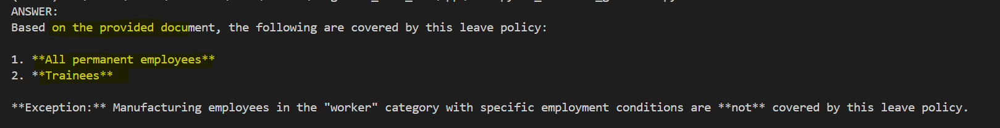

# LangChain Demo: RAG with Bedrock

## Overview

This is a simple demo project to learn **Retrieval-Augmented Generation (RAG)** using:

- `Amazon Bedrock` (Embeddings + LLM)
- `LangChain`
- `FAISS` (vector store)

---

## What is RAG

`RAG` improves LLM answers by grounding them in external data.

Instead of relying only on model knowledge:

- retrieve relevant content from documents
- send it as context to the LLM
- generate a more accurate, source-based answer

---

## Key Steps

PDF → Chunk → Embedding → Vector Store → Retrieval → LLM → Answer

1. Load PDF
2. Split into chunks
3. Create embeddings (Bedrock Titan)
4. Store in FAISS
5. Retrieve top-k relevant chunks
6. Send context + question to LLM (Claude Haiku)
7. Generate answer

---

## Example

Question: Who is covered by this leave policy?

