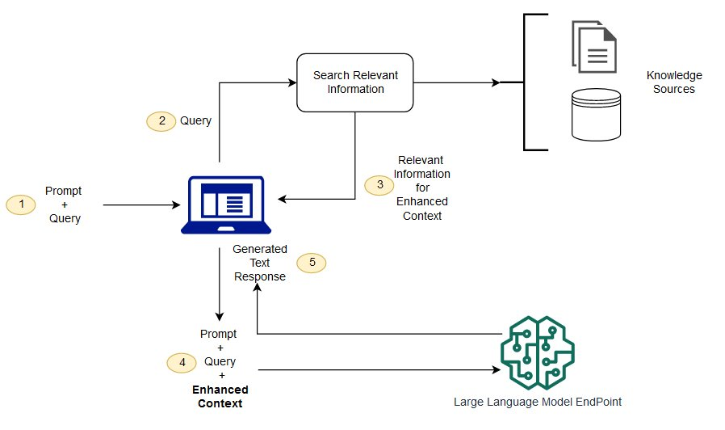
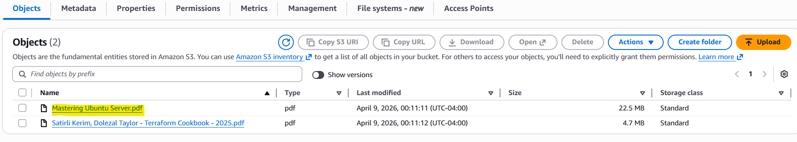
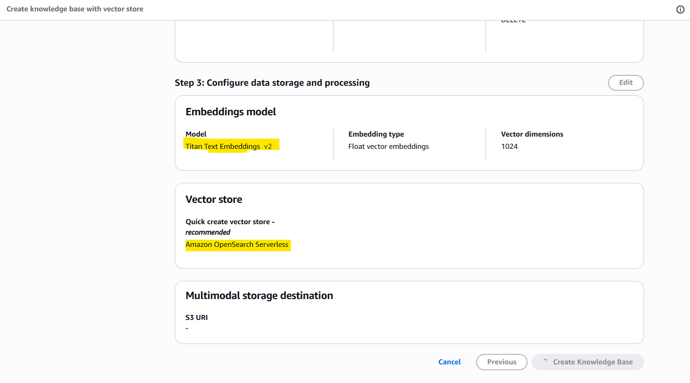
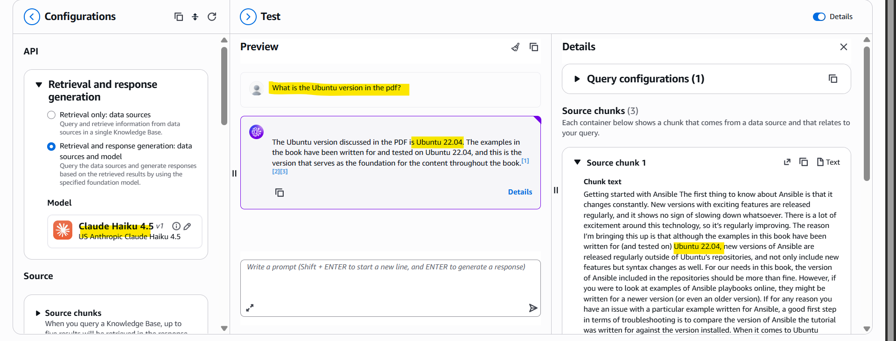
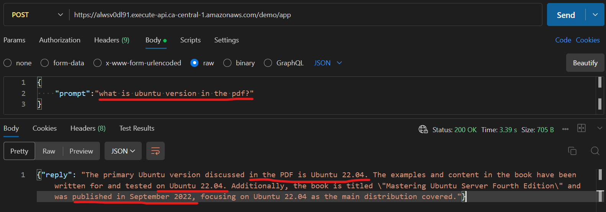

# RAG Demo with Bedrock

## What is RAG

**RAG (Retrieval-Augmented Generation)** improves LLM answers by grounding them in external data.

- **Retrieval**: Search for and fetch relevant information from an external data source.
- **Augmented**: Enhance and supplement the user's original prompt with high-quality information.
- **Generation**: Weave the retrieved facts into a coherent, natural-sounding response.

**vs Standard Generation**

| Feature          | Standard                    | RAG                              |
| ---------------- | --------------------------- | -------------------------------- |
| Knowledge Source | Internal training data only | Internal data + External data    |
| Accuracy         | Prone to hallucinations     | Highly factual and grounded      |
| Specialized Info | General public knowledge    | Can access private or niche data |
| Cost             | Lower                       | Slightly higher (longer prompts) |

---

## Approach 1: Local RAG with LangChain + FAISS

**Pipeline:**

PDF → Load (PyPDFLoader) → Split (RecursiveCharacterTextSplitter) →
Embed (Bedrock Titan) → Store (FAISS) → Retrieve →
LLM (Claude Haiku via Bedrock) → Answer

**Steps:**

1. **Load**: Load PDF documents (PyPDFLoader)
2. **Split**: Split text into chunks (RecursiveCharacterTextSplitter)
3. **Embed**: Create embeddings from chunks (Bedrock Titan)
4. **Store**: Store embeddings in vector database (FAISS)
5. **Retrieve**: Fetch top-k relevant chunks based on user query
6. **Generate**: Send context + question to LLM (Claude Haiku via Bedrock)
7. **Answer**: Return grounded response with sources

---

## Approach 2: AWS Bedrock Knowledge Bases

**Pipeline:**

Document (S3) → Ingest (Bedrock KB) → Index (OpenSearch) → Retrieve (Bedrock KB) → LLM (Claude via Bedrock) → Answer

**Key Components:**

- **S3**: Store source documents (PDFs, files, etc.)
- **Bedrock Knowledge Bases**: Handle ingestion, parsing, chunking, and embedding conversion
- **OpenSearch**: Vector database for fast semantic search and retrieval

**Workflows:**

- **Data Injection**: Upload documents to S3 → Sync with Bedrock KB → Auto-chunked and embedded → Indexed in OpenSearch
- **Query & Retrieval**: User query → Retrieve relevant docs from KB → Send context to LLM → Generate answer

---

### Deployment Methods

**Console Method** (Manual)

- Upload PDFs to S3
- Create Bedrock Knowledge Base in AWS Console
- Configure OpenSearch vector database
- Test queries in Bedrock console

---

**Terraform Method** (Infrastructure as Code)

- Define infrastructure in code (S3, Bedrock KB, OpenSearch, Lambda, API Gateway)
- Deploy with `terraform apply`
- Expose via REST API for programmatic access

