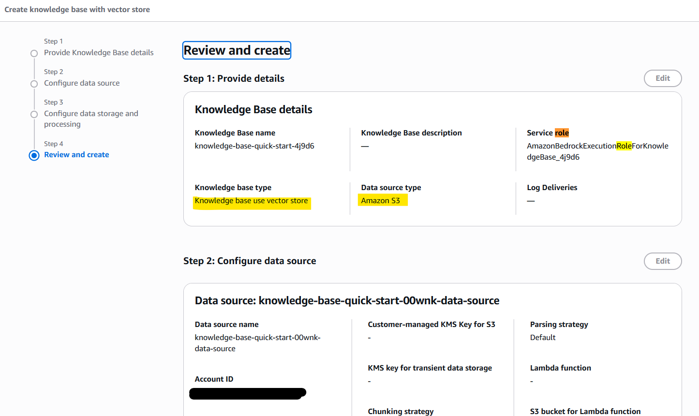

```sh
terraform -chdir=infra init -backend-config=backend.config -reconfigure
terraform -chdir=infra fmt && terraform -chdir=infra validate
terraform -chdir=infra apply -auto-approve
```

## Bedrock Knowledge Base




Bedrock
For query classification, text generation, and refining the set of relevant data or responses retrieved from a knowledge base.
Bedrock Knowledge Bases
For retrieving relevant information or data.
Can be integrated with search backends like OpenSearch and synced with S3 data sources.
AWS OpenSearch
Provides a fast and secure search engine to index and search large datasets or documents.
S3
For storing structured and unstructured data, such as schemas, files, and staging information ingested to the Knowledge Base.